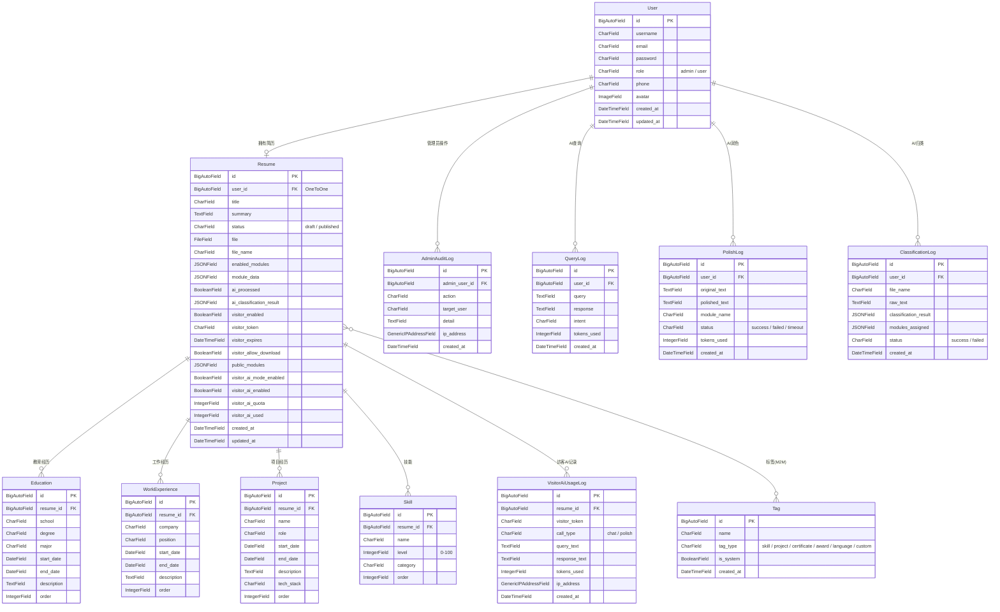

# 数据库设计

本文档描述智能简历管理系统的完整数据库结构与表间关系。

## ER 关系图

## 表关系说明

| 关系 | 类型 | 说明 |
|------|------|------|
| User → Resume | 一对一 | 一个用户对应一份简历 |
| Resume → Education | 一对多 | 一份简历包含多条教育经历 |
| Resume → WorkExperience | 一对多 | 一份简历包含多条工作经历 |
| Resume → Project | 一对多 | 一份简历包含多条项目经历 |
| Resume → Skill | 一对多 | 一份简历包含多项技能 |
| Resume ↔ Tag | 多对多 | 简历与标签互相绑定，通过中间表关联 |
| Resume → VisitorAiUsageLog | 一对多 | 访客的AI调用记录归属到对应简历 |
| User → AdminAuditLog | 一对多 | 审计日志记录操作管理员身份 |
| User → QueryLog | 一对多 | AI查询日志关联到发起查询的用户 |
| User → PolishLog | 一对多 | AI润色日志关联到发起润色的用户 |
| User → ClassificationLog | 一对多 | AI归类日志关联到上传文件的用户 |

## 所属应用

| 应用 | 表 |
|------|----|
| `apps.users` | User, AdminAuditLog |
| `apps.resumes` | Resume, Tag, Education, WorkExperience, Project, Skill, VisitorAiUsageLog |
| `apps.ai_assistant` | QueryLog, PolishLog, ClassificationLog |
